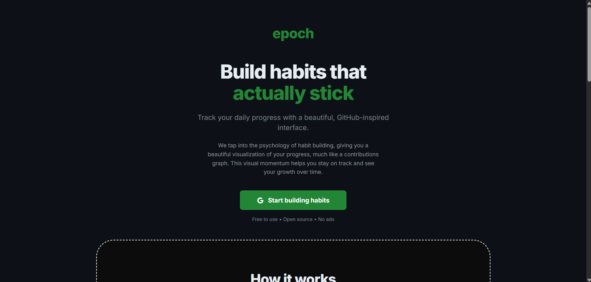
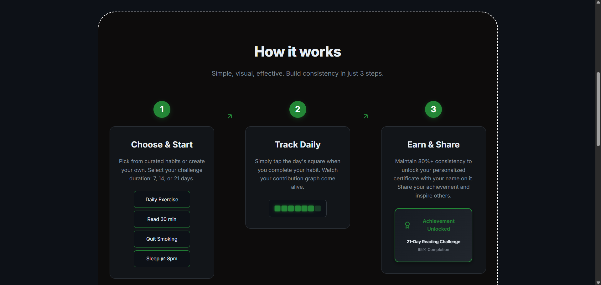
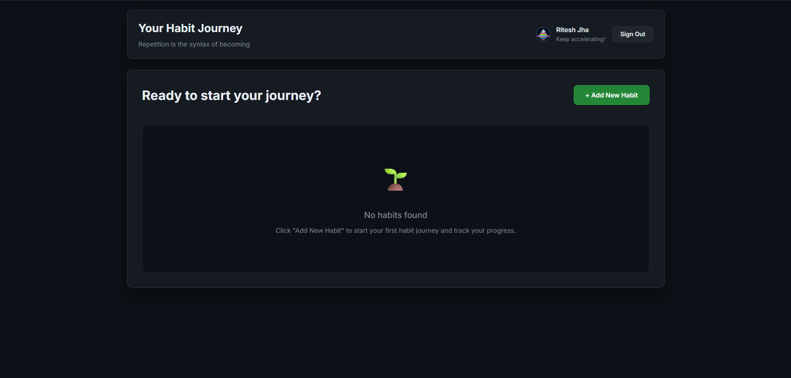
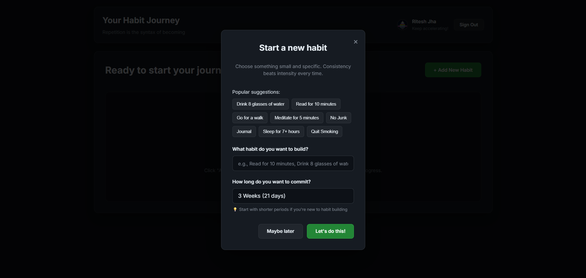
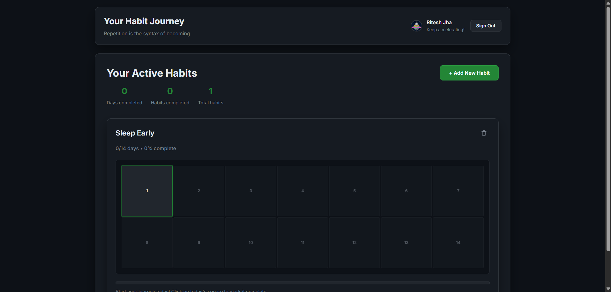
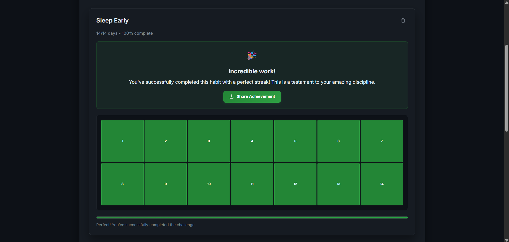
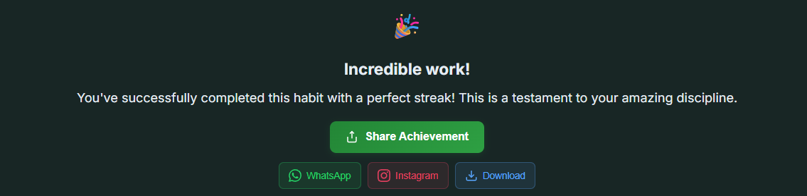
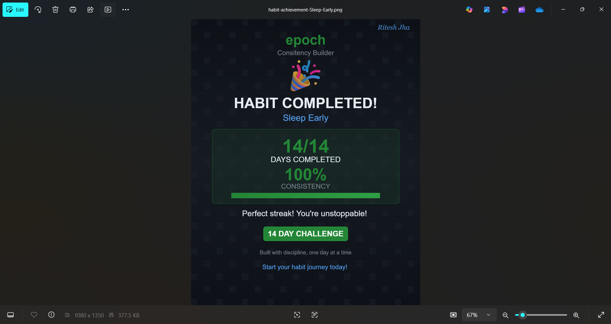

# epoch

> Build habits that actually stick — a minimal, open-source habit tracker with a GitHub-inspired contributions graph.

[](https://nextjs.org/)
[](https://react.dev/)
[](https://firebase.google.com/)

---

## View Live : https://epoch-daily.vercel.app/

## Screenshots

<p align="center">
  
  <!-- <br/>
   -->
  <br/>
  
  <br/>
  
  <br/>
  
  <br/>
  
  <br/>
  
</p>


<h3 align="center">View Downloaded Certificates in PNG Format</h3>

<p align="center">
  
</p>

## Project Structure

```
roooooooot/
├── components/
│   ├── AddHabitModal.
│   ├── Footer.js
│   ├── HabitGrid.js
│   ├── HowItWorks.js
│   ├── Layout.js
│   ├── ShareButton.js
│
├── lib/
│   ├── firebase.js
│   ├── utils.js
│
├── pages/
│   ├── api/
│   ├── _app.js
│   ├── _document.js
│   ├── index.js
│   ├── login.js
│
├── public/
│
├── styles/
│   ├── components/
│   │   ├── AddHabitModal.module.css
│   │   ├── Footer.module.css
│   │   ├── HabitGrid.module.css
│   │   ├── HowItWorks.module.css
│   │   ├── Layout.module.css
│   │   ├── ShareButton.module.css
│   │
│   ├── pages/
│   │   ├── index.module.css
│   │   ├── login.module.css
│   │
│   ├── Home.module.css
│   ├── globals.css
│
└── README.md   (You are reading this!)

```

## Tech Stack

Frontend: Next.js, React, Vanilla CSS

Backend: Firebase (Auth, Firestore, Push Notifs(maybe later))

Hosting: Vercel

---

## If you find this project useful, don’t forget to star ⭐ the repo!

## Made with ❤️ by Ritesh
